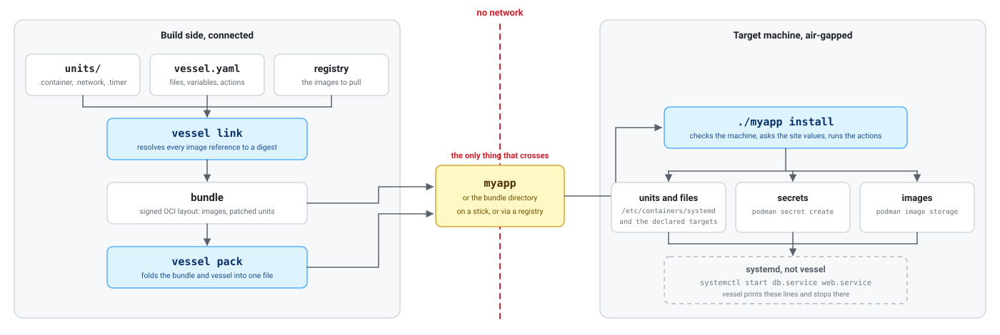

# vessel

Ship a container stack to a machine with no network.

<p align="center">
  <picture>
    <source media="(prefers-color-scheme: dark)" srcset="assets/vessel-dark.svg">
    
  </picture>
</p>

## The problem

An air-gapped site has no route to a registry. Nothing on that machine can pull an image, so the
whole stack has to arrive as files.

By hand that means a `podman save` per image, plus a tarball and a copy of the unit files. The site
values go on a sheet of paper. A tag like `postgres:17.2` points at a different image next month.
Two machines installed a week apart do not run the same code.

Vessel reads the descriptor you already have, pins every image to a digest, and writes one
executable. It travels on a USB stick. On the far machine it installs the stack, starts it, and can
later say what is there, upgrade it or take it off. No Kubernetes, no format to learn.

## Thirty seconds

```sh
vessel build ./units -o myapp   # pin every image to a digest, write one file
./myapp install                 # on the other side, it runs when this returns
```

## Maturity

v0: no tagged release, no CI, no production site yet. The command line, the bundle format and
`vessel.yaml` change without notice.

What exists is covered. `e2e/` drives the real command line against an in-memory registry. One test
checks the digest a unit pins against the manifest blob the bundle carries, byte for byte. Tests
that need podman skip themselves and name what is missing.

Run it on a lab machine and tell me where it breaks. Do not use it for a delivery you cannot repeat
by hand.

## Install vessel

```sh
go install github.com/Moq77111113/vessel/cmd/vessel@latest
```

Go 1.26 or newer. Only the machine that *builds* needs vessel: `myapp` carries its own copy.

## Build a delivery

`./units` is your [quadlet](https://docs.podman.io/en/latest/markdown/podman-systemd.unit.5.html)
directory, the systemd units that each run a container.

```sh
$ vessel build ./units -o myapp --name acme --version 1.4.0
  Resolving registry.example.com/acme/web:1.0
    Pulling registry.example.com/acme/web@sha256:dcc94eaf6f8694…
   Finished myapp, 11 MB, run it on the target machine
```

A private registry needs no flag: `build` reads the credentials the machine already keeps, so
`podman login registry.example.com` (or `docker login`) once is enough.

Every `Image=` tag comes out a digest. Nothing else in your file moves, comments and ordering
included:

```ini
[Container]
-Image=registry.example.com/acme/web:1.0
+Image=registry.example.com/acme/web@sha256:dcc94eaf6f86942cb6c1b93566b705177d1fd9a4c729e85de5dc430ef17aeb78
Network=app.network
```

`myapp` is your whole delivery: copy it onto a stick and you are done.

`--layout ./bundle` writes the OCI layout beside it, for a CI job that archives deliveries on a
registry. The executable is that same layout with a copy of vessel in front of it.

```sh
$ vessel build ./units -o myapp --layout ./bundle
$ skopeo copy --all oci:./bundle:acme:1.4.0 docker://registry.example.com/deliveries/acme:1.4.0
```

A machine that already carries vessel installs such a layout directly, with `vessel install ./bundle`.

## Declare a delivery

A `vessel.yaml` at the root of your delivery directory declares what a unit cannot carry: plain
files, site values, secrets and commands to run. It names the units directory, so `build` reads the
delivery root, not the units:

```sh
acme/
  vessel.yaml
  realm.json
  units/
    web.container
    db.container
$ vessel build ./acme -o myapp
```

```yaml
name: acme
version: 1.4.0
units: ./units
files:
  - source: realm.json
    target: /etc/acme/realm.json
variables:
  - name: PUBLIC_HOST
    description: the public address of this machine
  - name: DB_PASSWORD
    secret: true
    from: openssl rand -hex 32
actions:
  - mkdir -p /etc/acme/certs
```

`DB_PASSWORD` needs a unit carrying `Secret=DB_PASSWORD`, or `build` refuses it. A bundle name is a
plain lowercase identifier (`acme`, `dmas-c2`); the machine keeps the delivery's values under
`/var/lib/vessel/<name>/`. A value comes from `--set`, a previous install, or `from:`, in that
order; missing all three blocks it, and `--set` on an undeclared variable or an empty value is also
an error.

```sh
$ ./myapp install --set PUBLIC_HOST=203.0.113.10
   Finished acme 1.4.0 installed and running: 2 images, 4 of 4 files changed
```

A missing value stops the install before the first file is written:

```sh
$ ./myapp install
vessel: SITE_NAME is not set: the name this site goes by
```

vessel never asks at a keyboard. An answer typed at a prompt exists nowhere afterwards, and the
whole point is a delivery you can repeat: `--set` is a line you put on the install sheet, in the
playbook, and on the next machine identically.

`DB_PASSWORD` never reaches disk or the screen; it comes from `from:` or `--set`, `install` runs
`podman secret create DB_PASSWORD` for it, and the unit reads it back under that name:

```ini
[Container]
Secret=DB_PASSWORD,type=env,target=POSTGRES_PASSWORD
```

The podman secret name is the variable name; `build` refuses a secret no unit reads that way, and
rotating one is `podman secret rm DB_PASSWORD` then another install.

Actions run first, before files and images, with an effect and nothing else: never a value, never a
stand-in for a unit. They run on every install, so write them idempotent, the way `mkdir -p` is.

## Install on the target machine

```sh
$ ./myapp inspect                        # reads and prints, writes nothing
acme 1.4.0, read by quadlet, resolved for linux/amd64 on 2026-09-05T15:11:56Z
image registry.example.com/acme/web:1.0   sha256:dcc94eaf6f8694…
file  etc/containers/systemd/web.container 315 bytes

$ ./myapp install
These secrets are not on this machine yet, the units need them:
  podman secret create DB_PASSWORD <file>

   Finished acme 1.4.0 installed and running: 2 images, 3 of 3 files changed
```

`install` returns once the services are up, and fails if one did not come up. It never watches or
restarts anything afterwards.

Secrets and certificates never travel inside `myapp`. When a unit asks for one, `install` names it
instead of letting the service fail later for no visible reason. Running `install` twice changes
nothing the second time.

If the machine is not ready, `install` says so **before writing anything**, and names every problem
at once:

```
vessel: this machine is not ready:
  podman is too old for quadlet: found 4.3.1, want 5.0 or newer
  cannot write to /etc/containers/systemd
```

## Live with it on the machine

`install` writes a record of what it put there, under `/var/lib/vessel/<name>/`. Three verbs read
it.

```sh
$ ./myapp status
acme 1.4.0, installed 2026-09-12T16:53:46Z
previous 1.3.0, installed 2026-03-02T09:14:11Z
    Service web.service running
    Differs etc/acme/realm.json
```

`Differs` was edited since the install, `Absent` is gone, and `this install never finished` means
it died partway. `vessel status` with no name lists every delivery the machine holds.

`upgrade` is `install` plus one thing: what the previous version put and this one no longer carries
is stopped and removed. It refuses a machine holding no record.

`uninstall` stops the services, then removes exactly the files its record names, never one it did
not put. It leaves the podman secrets, the images and the site values, and names all three: another
delivery may need them.

## Ansible

Nothing waits on a terminal, so a playbook never hangs. The exit code says what happened.

| code | meaning |
|---|---|
| 0 | installed and running |
| 3 | the machine is not ready, nothing was read |
| 4 | the delivery was refused, the machine was not touched |
| 5 | the install failed partway, the machine changed |

A 5 leaves the record open, so `status` names it and running `install` again resumes.

## Requirements

The descriptor decides the runtime. Quadlet units install with podman and start with systemd, so
the machine needs Debian 13+, RHEL 9+ or Rocky 9+, podman 5.0 or newer, systemd, and root. The
floor is podman 4.4, where quadlet arrived, and Debian 12 ships 4.3.

## Signing

Integrity is always on: every part of a bundle is pinned by sha256, and vessel refuses a file that
does not match. Who *built* the file is a different question, and a binary cannot vouch for itself.
So print the checksum on the install sheet and have the operator compare it:

```sh
sha256sum myapp
```

`vessel build --key vessel.key` also writes a `myapp.minisig`, for sites that run a
[minisign](https://jedisct1.github.io/minisign/) step.

Stronger, when you can put a binary in your machine image: build it with your public key baked in
(`make build KEY=vessel.pub`), sign the layout with `vessel build --key --layout`, and ship that
layout rather than the executable. That binary checks the signature itself, with nothing to
compare by hand.

## Contributing

```sh
go build ./cmd/vessel
go test ./...
```

Tests that need podman skip themselves, naming what is missing, so the suite is green on a laptop
with no container runtime.

MIT. See [LICENSE](LICENSE).
